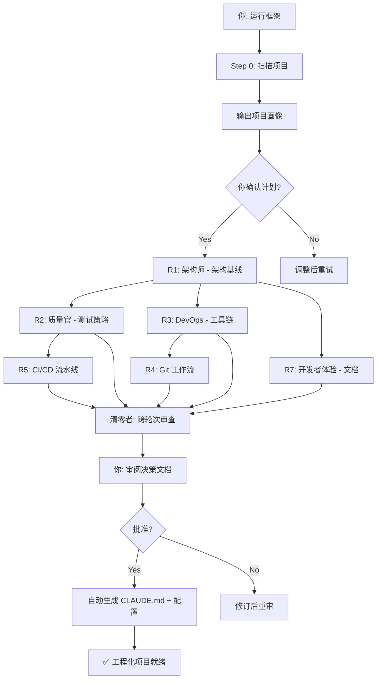

# Project Readiness Council

[](https://github.com/biandeshen/project-ready/actions/workflows/ci.yml)

> 一个可执行的工程化基线框架，让 Claude Code 为任何项目建立质量、测试、工具链、CI/CD 等基础规范。
>
> **原理：** 多角色 × 多轮次结构化审计 → 决策文档 → 自动生成 CLAUDE.md + 配置文件

---

## 目录

- [一句话说明](#一句话说明)
- [快速使用](#快速使用)
- [项目类型检测](#项目类型检测)
- [文件结构](#文件结构)
- [与 AMPHOREUS 的关系](#与-amphoreus-design-council-的关系)

---

## 一句话说明

把项目现有的代码给这个框架，它会：

1. 扫描项目 → 识别语言/框架/现有基建
2. 按专业视角和标准轮次逐个审计缺口
3. 你审批每个轮次的产出
4. 最终自动生成 CLAUDE.md、ESLint 配置、CI/CD 配置、测试框架初始化

结果是一个 **有标准、有测试、有 CI、有文档**的工程化项目。



---

## 快速使用

**安装：**

```bash
# 克隆框架
git clone https://github.com/biandeshen/project-ready.git
# 安装到目标项目
bash project-ready/installer/install.sh /path/to/your-project
```

或者直接从远程安装：

```bash
bash <(curl -s https://raw.githubusercontent.com/biandeshen/project-ready/main/installer/install.sh) /path/to/your-project
```

然后在 Claude Code 中：

```
read .claude/readiness/playbook.md and execute it
```

---

## 项目类型检测

| 自动检测到 | 走什么路线 |
|:-----------|:-----------|
| package.json + tsconfig → Web 全栈 | 全 6 轮 + 5 角色 |
| Cargo.toml → Rust 项目 | R1-R3 + R4 |
| requirements.txt → Python 项目 | R1-R3 + R6 |
| 单/少文件脚本 → 轻量模式 | R1(R2) 15 分钟 |

---

## 文件结构

```
├── playbook.md                ← 核心执行流程
├── src/
│   ├── roles/                 ← 6 个角色定义
│   ├── rounds/                ← 8 个轮次模板
│   ├── templates/             ← 输出/决策模板
│   └── archetypes/            ← 项目类型预配置
├── installer/                 ← 安装脚本
├── docs/                      ← 哲学/贡献/路线图
└── examples/                  ← 演示输出
```

---

## 与 AMPHOREUS Design Council 的关系

| | 设计议会 | 就绪委员会 |
|:--|:---------|:-----------|
| 场景 | 从零设计架构 | 棕场项目工程化 |
| 约束 | 零约束、推倒重来 | 兼容现有代码 |
| 产出 | 架构共识文档 | CLAUDE.md + 配置文件 |
| 角色 | 10 个架构视角 | 6 个工程化视角 |

兄弟项目，相互独立。
